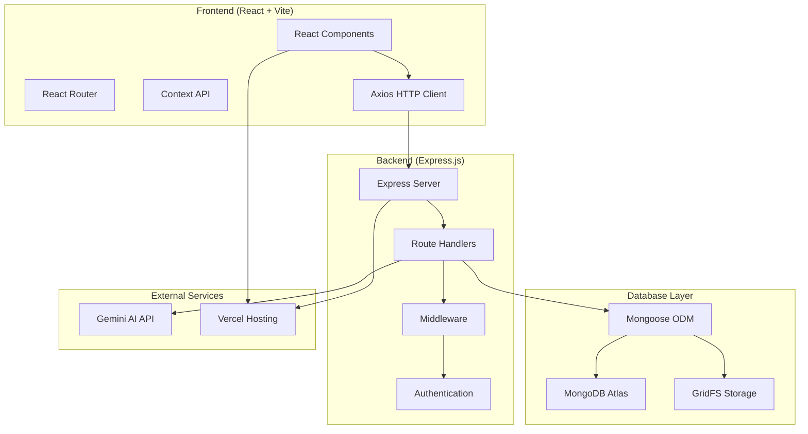
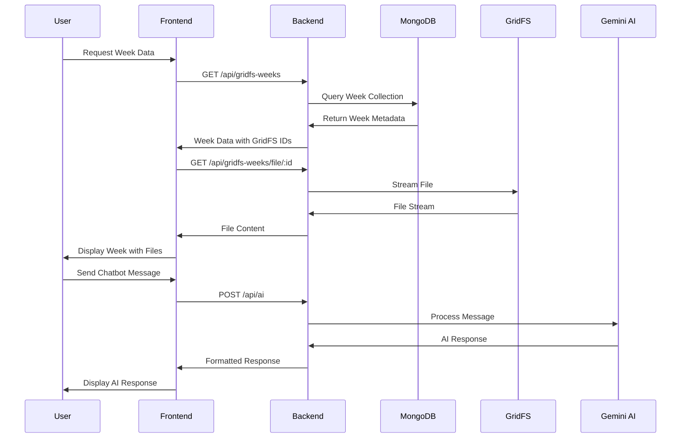
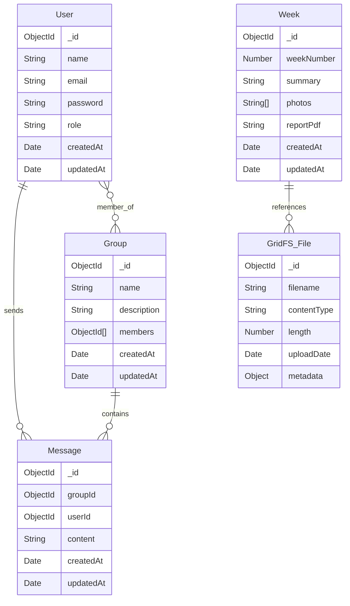

# Design Document

## Overview

The CSP Website is a comprehensive MERN stack application designed to serve as a centralized platform for Computer Science Program students and administrators. The system integrates MongoDB Atlas with GridFS for efficient file storage, implements a Gemini AI-powered chatbot for career guidance, and provides group-based communication features. The application follows a modern, responsive design pattern with React frontend, Express.js backend, and MongoDB database.

### Key Features
- **Weekly Program Data Management**: Display and manage 5 weeks of program data with photos, summaries, and documents
- **AI-Powered Chatbot**: Contextual career guidance using Gemini/AskAI integration
- **Group Communication**: Admin-managed groups with real-time chat functionality
- **Career Resources**: Dedicated section for career guidance materials (PPT/PDF viewer)
- **GridFS Integration**: Efficient storage and streaming of large files (images, PDFs, presentations)

## Architecture

### System Architecture



### Data Flow Architecture



## Components and Interfaces

### Frontend Components

#### Core Components
1. **App.jsx**
   - Main application wrapper with routing
   - Sidebar integration and responsive layout
   - Authentication context provider

2. **WeekView.jsx**
   - Displays weekly program data from GridFS
   - Photo gallery with responsive grid layout
   - PDF/PPT viewer integration
   - Error handling for missing files

3. **AskAI.jsx**
   - Floating chatbot widget with minimize/maximize functionality
   - Real-time message exchange with backend
   - Quick question suggestions
   - Loading states and error handling

4. **Groups.jsx**
   - Group listing and management interface
   - Real-time chat functionality
   - Join/leave group operations
   - Message history display

5. **Sidebar.jsx**
   - Navigation component with responsive design
   - Route-based active state management
   - Mobile-friendly hamburger menu

#### Page Components
1. **Main.jsx** - Landing page with overview
2. **Auth.jsx** - Authentication (login/register)
3. **AdminDashboard.jsx** - Admin-only features
4. **CareerGuidance.jsx** - Career resources display

### Backend API Endpoints

#### Week Management Routes (`/api/gridfs-weeks`)
```javascript
GET    /                    // Fetch all weeks
GET    /:id                 // Fetch single week by ID
GET    /file/:id            // Stream file by GridFS ID
POST   /add                 // Upload new week (Admin only)
DELETE /:id                 // Delete week and files (Admin only)
```

#### Group Management Routes (`/api/groups`)
```javascript
GET    /                    // List all groups
POST   /                    // Create new group (Admin only)
POST   /:id/join            // Join group
POST   /:id/leave           // Leave group
GET    /:id/messages        // Get group messages
POST   /:id/messages        // Send message to group
```

#### AI Chatbot Routes (`/api/ai`)
```javascript
POST   /                    // Send message to AI and get response
```

#### Authentication Routes (`/api`)
```javascript
POST   /login               // User authentication
POST   /register            // User registration
GET    /profile             // Get user profile
```

### Database Models

#### Week Model
```javascript
{
  weekNumber: Number (required, unique),
  summary: String (required),
  photos: [String], // Array of GridFS file IDs
  reportPdf: String, // GridFS file ID
  timestamps: true
}
```

#### Group Model
```javascript
{
  name: String (required, unique),
  description: String,
  members: [ObjectId] (ref: 'User'),
  timestamps: true
}
```

#### Message Model
```javascript
{
  groupId: ObjectId (ref: 'Group', required),
  userId: ObjectId (ref: 'User', required),
  content: String (required),
  timestamps: true
}
```

#### User Model
```javascript
{
  name: String (required),
  email: String (required, unique),
  password: String (required, hashed),
  role: String (enum: ['admin', 'student'], default: 'student'),
  timestamps: true
}
```

## Data Models

### GridFS File Storage Strategy

#### File Organization
- **Bucket Name**: "uploads"
- **File Naming**: `${timestamp}-${originalname}`
- **Supported Types**: Images (JPG, PNG, GIF), PDFs, PowerPoint presentations

#### File Metadata Structure
```javascript
{
  _id: ObjectId,
  filename: String,
  contentType: String,
  length: Number,
  chunkSize: Number,
  uploadDate: Date,
  metadata: {
    weekNumber: Number, // Optional: for week-related files
    fileType: String,   // 'photo', 'report', 'career-guidance'
    uploadedBy: ObjectId // User ID
  }
}
```

### Data Relationships



## Error Handling

### Frontend Error Handling Strategy

#### Component-Level Error Boundaries
```javascript
// Error states for each major component
const [error, setError] = useState(null);
const [loading, setLoading] = useState(false);

// Standardized error handling
const handleError = (error) => {
  setError(error.response?.data?.error || error.message || 'An error occurred');
  setLoading(false);
};
```

#### Network Error Handling
- **Connection Failures**: Display retry mechanisms
- **Timeout Errors**: Show appropriate user feedback
- **API Errors**: Parse and display meaningful error messages
- **File Loading Errors**: Fallback images and error states

### Backend Error Handling Strategy

#### Middleware Error Handler
```javascript
app.use((err, req, res, next) => {
  console.error(err.stack);
  
  // GridFS specific errors
  if (err.name === 'GridFSError') {
    return res.status(404).json({ error: 'File not found' });
  }
  
  // MongoDB errors
  if (err.name === 'ValidationError') {
    return res.status(400).json({ error: err.message });
  }
  
  // Default error
  res.status(500).json({ error: 'Internal server error' });
});
```

#### Database Connection Fallback
- **MongoDB Unavailable**: Graceful degradation to local data
- **GridFS Errors**: Appropriate HTTP status codes and messages
- **Authentication Failures**: Clear error messages and redirect handling

### AI Service Error Handling
- **API Rate Limits**: Queue management and retry logic
- **Service Unavailable**: Fallback responses and user notification
- **Invalid Responses**: Response validation and error recovery

## Testing Strategy

### Frontend Testing Approach

#### Unit Testing (Jest + React Testing Library)
```javascript
// Component testing example
describe('WeekView Component', () => {
  test('renders week data correctly', () => {
    render(<WeekView />);
    expect(screen.getByText('Weekly Updates')).toBeInTheDocument();
  });
  
  test('handles loading state', () => {
    render(<WeekView />);
    expect(screen.getByTestId('loading-spinner')).toBeInTheDocument();
  });
  
  test('displays error message on fetch failure', async () => {
    // Mock API failure
    jest.spyOn(axios, 'get').mockRejectedValue(new Error('Network Error'));
    render(<WeekView />);
    await waitFor(() => {
      expect(screen.getByText(/Error Loading Weeks/)).toBeInTheDocument();
    });
  });
});
```

#### Integration Testing
- **API Integration**: Test frontend-backend communication
- **Route Testing**: Verify navigation and routing behavior
- **Context Testing**: Validate state management across components

### Backend Testing Approach

#### API Endpoint Testing (Jest + Supertest)
```javascript
describe('GridFS Week Routes', () => {
  test('GET /api/gridfs-weeks returns all weeks', async () => {
    const response = await request(app)
      .get('/api/gridfs-weeks')
      .expect(200);
    
    expect(Array.isArray(response.body)).toBe(true);
  });
  
  test('GET /api/gridfs-weeks/file/:id streams file', async () => {
    const response = await request(app)
      .get(`/api/gridfs-weeks/file/${validFileId}`)
      .expect(200);
    
    expect(response.headers['content-type']).toBeDefined();
  });
});
```

#### Database Testing
- **Model Validation**: Test schema constraints and validations
- **GridFS Operations**: Verify file upload, retrieval, and deletion
- **Relationship Testing**: Validate foreign key constraints and population

### End-to-End Testing Strategy

#### User Journey Testing
1. **Student Workflow**
   - View weekly updates with photos and documents
   - Interact with AI chatbot for career guidance
   - Join groups and participate in discussions

2. **Admin Workflow**
   - Upload new weekly content
   - Create and manage groups
   - Monitor system usage and performance

#### Performance Testing
- **File Streaming**: Test large file download performance
- **Concurrent Users**: Validate system behavior under load
- **Database Queries**: Optimize query performance and indexing

### Deployment Testing

#### Pre-deployment Checklist
- [ ] All environment variables configured
- [ ] Database connections verified
- [ ] GridFS file access tested
- [ ] AI API integration confirmed
- [ ] Build process successful
- [ ] Static assets properly served

#### Post-deployment Verification
- [ ] All routes accessible
- [ ] File streaming functional
- [ ] Chatbot responses working
- [ ] Group functionality operational
- [ ] Mobile responsiveness verified

## Security Considerations

### Authentication & Authorization
- **JWT Token Management**: Secure token storage and validation
- **Role-Based Access**: Admin vs. student permission levels
- **Password Security**: bcrypt hashing with salt rounds

### Data Protection
- **Input Validation**: Sanitize all user inputs
- **File Upload Security**: Validate file types and sizes
- **API Rate Limiting**: Prevent abuse and DoS attacks

### Environment Security
- **Environment Variables**: Secure storage of sensitive data
- **CORS Configuration**: Restrict cross-origin requests
- **HTTPS Enforcement**: Secure data transmission

This design provides a comprehensive foundation for implementing the CSP website with all required features, proper error handling, and robust testing strategies.